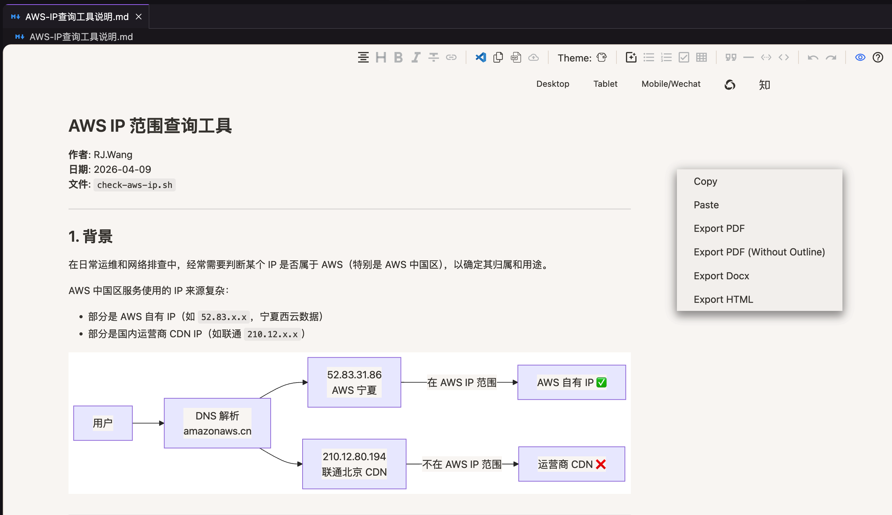

# Office Viewer Enhanced

直接在 VS Code 和 Kiro 中预览 Word、Excel、PDF、Markdown 等文件。支持导出图片内嵌的独立 HTML，并内置 Mermaid v11 支持，可正确渲染新版图表语法。

## Office Viewer（Fork）

> Fork 自 [cweijan/vscode-office](https://github.com/cweijan/vscode-office)，由 [RJ.Wang](mailto:wangrenjun@gmail.com) 维护。

这是对原项目的持续维护版本，重点改进了易用性、可移植性、离线支持以及安装包体积。

## 本 Fork 的改进

- **独立 HTML 导出**
  - 导出 HTML 时会自动将本地图片转换为 Base64 并嵌入文件中
  - 生成的 `.html` 文件可直接分享，无需额外附带本地图片资源
- **更小的安装包**
  - 移除了内置的 Icon Theme 和 Java 反编译器，让扩展更专注文档预览
  - 安装包体积减少约 4.4 MB
- **更现代的 Mermaid 支持**
  - Mermaid 从 v8.8.0 升级到 v11.14.0
  - 新版 Mermaid 语法可以正确渲染
  - Mermaid 改为本地加载，不依赖 CDN，离线使用更稳定
  - 使用轻量内置集成替换了已弃用的 `markdown-it-mermaid`
- **更清爽的渲染效果**
  - Markdown 预览现在会铺满编辑器可用宽度，不再过早换行
  - Mermaid 图表和文档内容默认左对齐，不再居中
  - 清理了无用代码并修复了多处拼写错误

## 介绍

[English](README.md) | 简体中文

本扩展支持在 VS Code 中预览以下文件类型：

- Excel：`.xls`、`.xlsx`、`.csv`
- Word：`.docx`
- SVG：`.svg`
- PDF：`.pdf`
- 字体：`.ttf`、`.otf`、`.woff`、`.woff2`
- Markdown：`.md`
- HTTP 请求：`.http`
- Windows 注册表文件：`.reg`
- 压缩文件：`.zip`、`.jar`、`.vsix`、`.rar`

## Markdown

本扩展会使用 Vditor 替换默认的 Markdown 编辑器。请注意，Vditor 已不再积极维护。

如果你想使用原生 VS Code Markdown 编辑器，请在 `settings.json` 中加入以下配置：

```json
{
    "workbench.editorAssociations": {
        "*.md": "default",
        "*.markdown": "default"
    }
}
```

在编辑器中右键即可将 Markdown 导出为 PDF、DOCX 或 HTML。导出 PDF 依赖 Chromium，可通过 `vscode-office.chromiumPath` 配置其可执行文件路径。

导出 HTML 时，所有本地图片都会自动转换为 Base64 并嵌入文件中，因此导出的文件是完全独立的，分享时无需再附带图片资源。



快捷键基于 [Vditor 快捷键](shortcut.md)，并额外提供以下命令：

- 列表上移一行：`Ctrl+Alt+I` / `⌘ ^ I`
- 列表下移一行：`Ctrl+Alt+J` / `⌘ ^ J`
- 在 VS Code 中编辑：`Ctrl+Alt+E` / `⌘ ^ E`

提示：

- 可通过 Ctrl/Cmd + 鼠标滚轮调整编辑器大小
- 可通过 Ctrl/Meta + 点击或双击打开超链接

## HTML

HTML 编辑器支持实时预览。按 `Ctrl+Shift+V` 即可打开实时视图。

## Credits

- PDF rendering: [mozilla/pdf.js/](https://github.com/mozilla/pdf.js/)
- DOCX rendering: [VolodymyrBaydalka/docxjs](https://github.com/VolodymyrBaydalka/docxjs)
- XLSX rendering:
  - [SheetJS/sheetjs](https://github.com/SheetJS/sheetjs): XLSX parsing
  - [myliang/x-spreadsheet](https://github.com/myliang/x-spreadsheet): XLSX rendering
- HTTP: [Rest Client](https://github.com/Huachao/vscode-restclient)
- Markdown: [Vanessa219/vditor](https://github.com/Vanessa219/vditor)
- Mermaid diagrams: [mermaid-js/mermaid](https://github.com/mermaid-js/mermaid)
