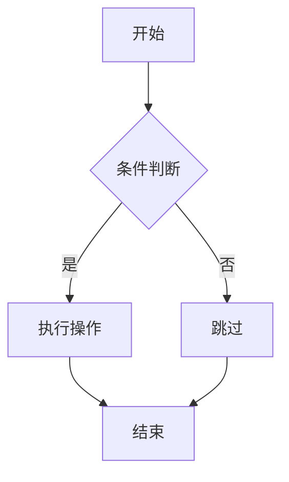
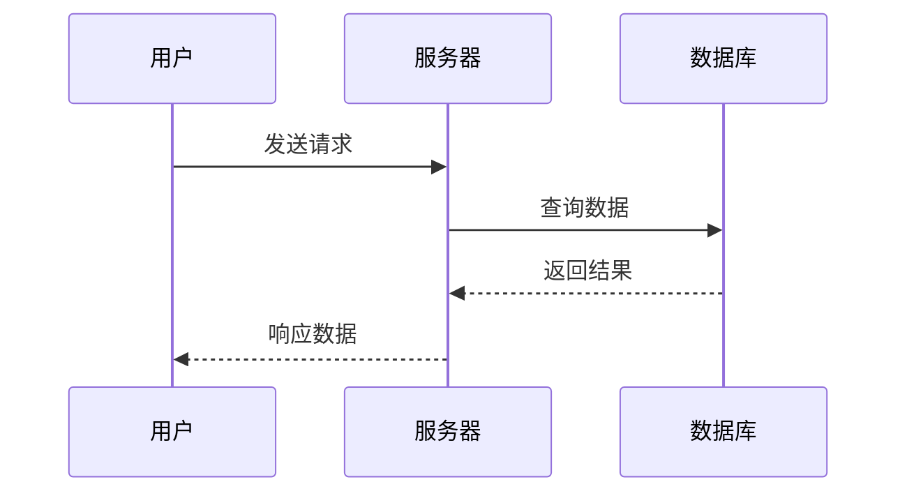
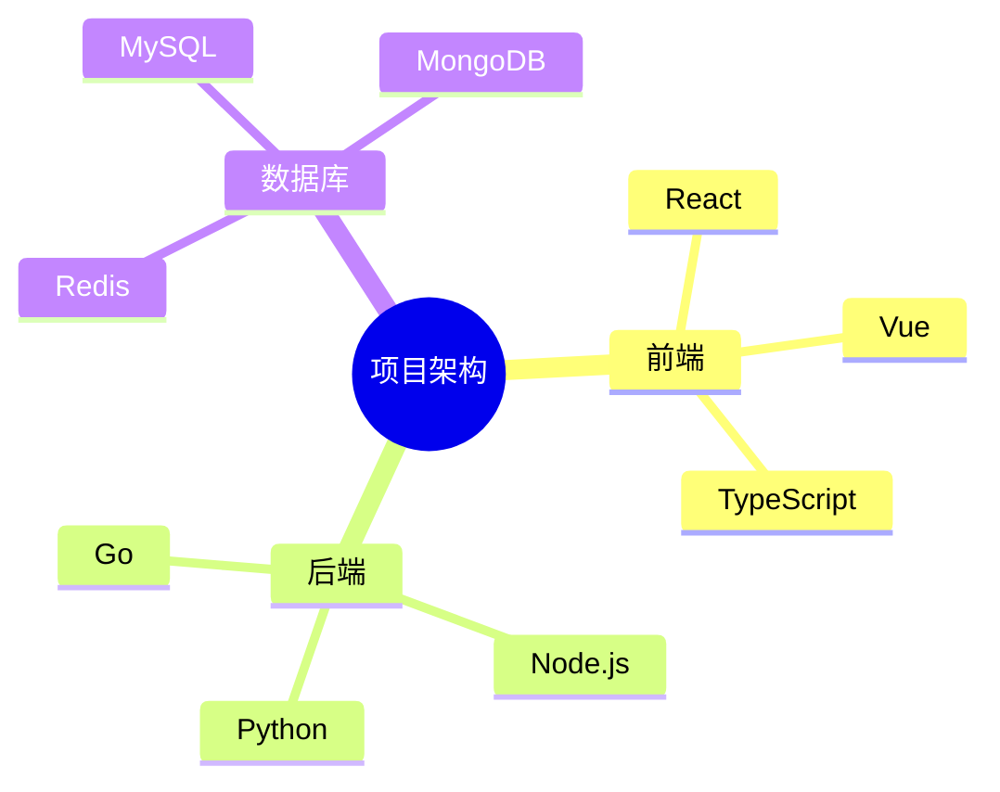
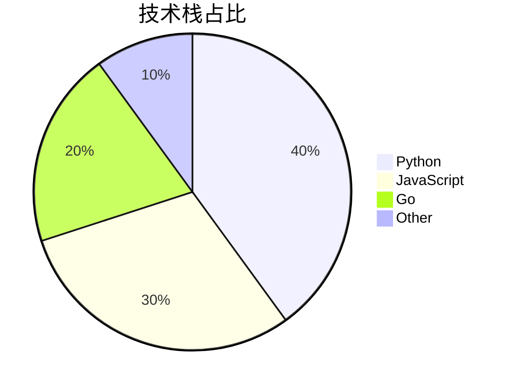
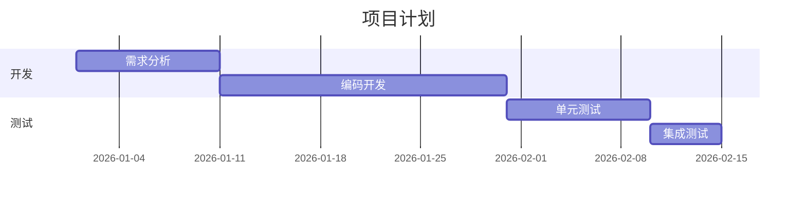
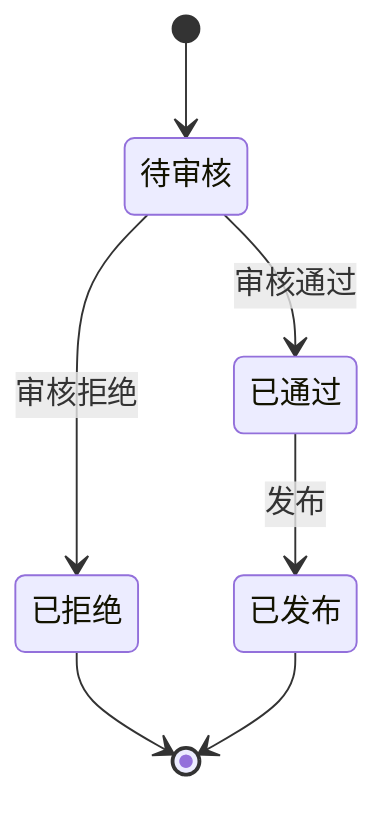
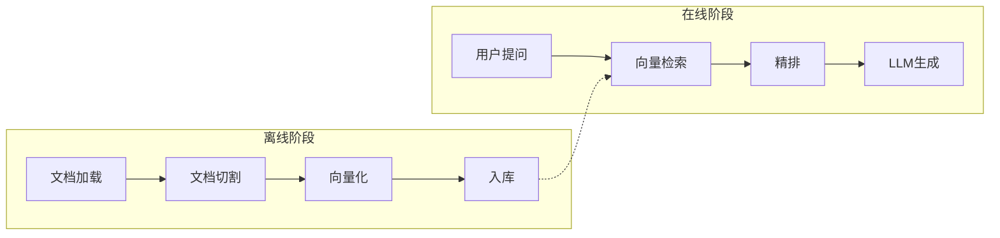
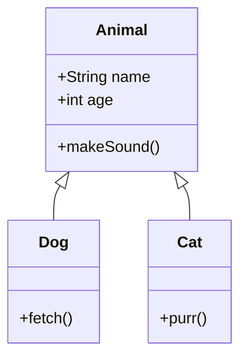
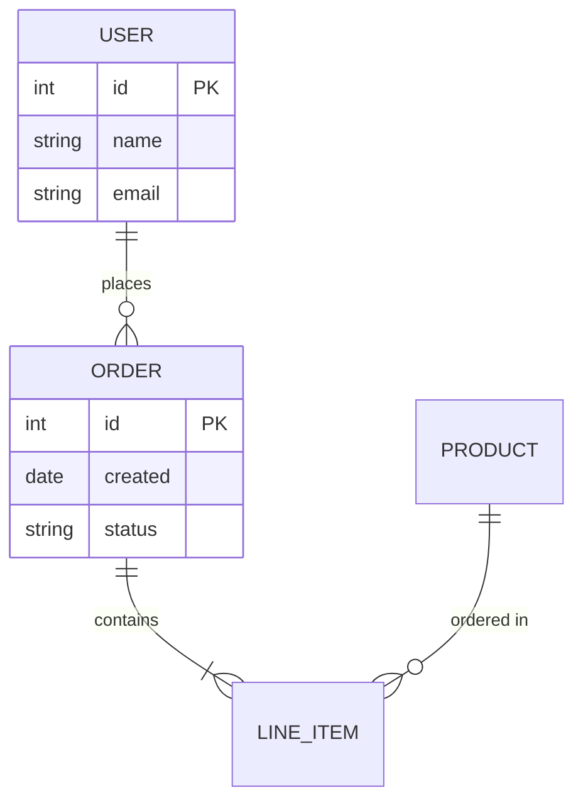
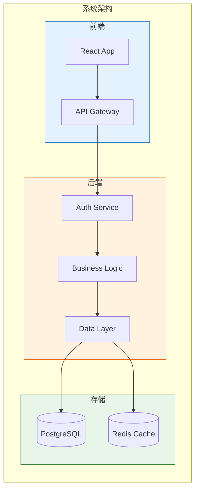

# 🧪 渲染验证测试文档

> 用于每次插件更新后验证 Mermaid 图表和 Emoji 渲染是否正常。
> 编辑模式和预览模式都需要检查。

---

## 1. Mermaid 图表测试

### 1.1 Flowchart

### 1.2 Sequence Diagram

### 1.3 Mindmap

### 1.4 Pie Chart

### 1.5 Gantt

### 1.6 State Diagram

### 1.7 Subgraph

### 1.8 Class Diagram

### 1.9 ER Diagram

### 1.10 复杂 Flowchart（含样式）

---

## 2. Emoji 渲染测试

### 2.1 常规 Emoji（Lute 内置）

| Emoji | 名称 | 状态 |
|-------|------|------|
| 📘 | blue book | 应正常 |
| 🔍 | magnifying glass | 应正常 |
| 🔴 | red circle | 应正常 |
| 🚀 | rocket | 应正常 |
| ✅ | check mark | 应正常 |
| ❌ | cross mark | 应正常 |
| 🎉 | tada | 应正常 |
| 👍 | thumbs up | 应正常 |
| ❤️ | heart | 应正常 |
| 🤖 | robot | 应正常 |

### 2.2 几何 Emoji（Unicode 12.0+，通过 PutEmojis 注入）

| Emoji | 名称 | 状态 |
|-------|------|------|
| 🟡 | yellow circle | 需注入 |
| 🟢 | green circle | 需注入 |
| 🟠 | orange circle | 需注入 |
| 🟣 | purple circle | 需注入 |
| 🟤 | brown circle | 需注入 |
| ⬜ | white square | 需注入 |
| ⬛ | black square | 需注入 |
| 🟥 | red square | 需注入 |
| 🟧 | orange square | 需注入 |
| 🟨 | yellow square | 需注入 |
| 🟩 | green square | 需注入 |
| 🟦 | blue square | 需注入 |
| 🟪 | purple square | 需注入 |
| 🟫 | brown square | 需注入 |
| ⭐ | star | 需注入 |
| 💬 | speech balloon | 需注入 |

### 2.3 实际使用场景

| # | 事项 | 优先级 | 状态 |
|---|------|--------|------|
| 1 | 部署新版本 | 🟡 中 | 待执行 |
| 2 | 修复线上 Bug | 🔴 高 | 需检查 |
| 3 | 监控稳定性 | 🟢 低 | 持续观察 |
| 4 | 代码审查 | 🟠 中高 | 进行中 |
| 5 | 文档更新 | 🟣 低 | 已完成 ✅ |

### 2.4 混合 Emoji 段落

🚀 项目启动后，团队分为三组：

- 🟦 **前端组**：负责 React 应用开发，使用 TypeScript 📘
- 🟩 **后端组**：负责 API 和数据库 🔍，确保 ⭐ 级性能
- 🟧 **测试组**：编写自动化测试 🤖，覆盖率目标 > 80%

💬 每日站会 15 分钟，🟥 阻塞问题优先讨论。

---

## 3. 验证清单

- [ ] 编辑模式：所有 Mermaid 图表正常渲染
- [ ] 预览模式：所有 Mermaid 图表正常渲染，无互相串图
- [ ] 编辑模式：常规 Emoji 正常显示
- [ ] 编辑模式：几何 Emoji（🟡🟢🟥等）正常显示
- [ ] 预览模式：所有 Emoji 正常显示
- [ ] Reload 按钮：点击后内容刷新
- [ ] Edit Mode 切换按钮：可在 wysiwyg/ir/sv 间切换
